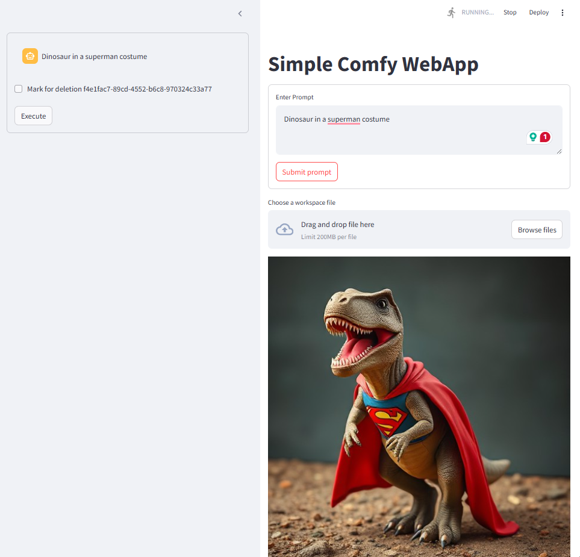

# st_comfy

Simple comfy webapp implemented using python streamlit, provides history in the side bar
Lazy listen using asyncio on last image in listen directory

Loads a gguf flux schnell workflow

Update server_port and listen_path to suit your own needs

Todo: 
   - fix asyncio bug with sidebar
   - use websockets to get latest image 

   